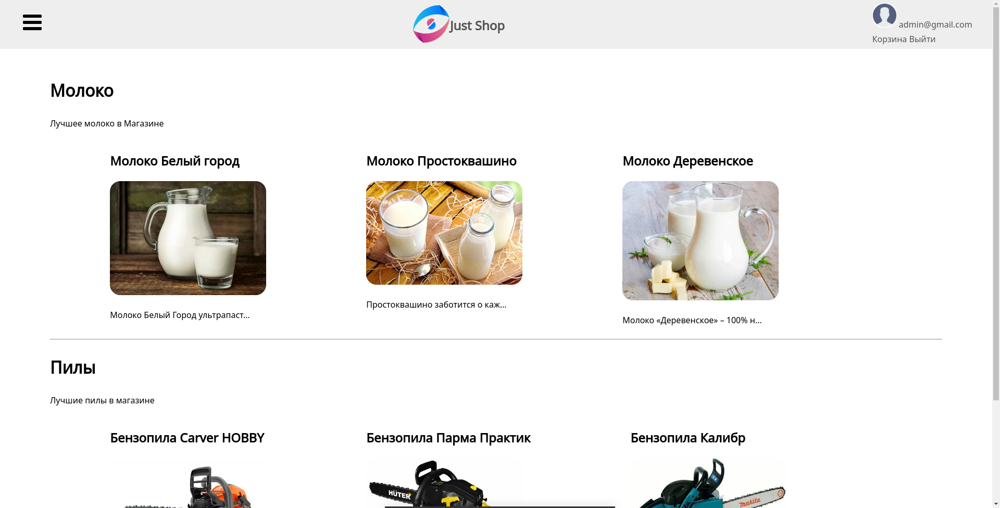
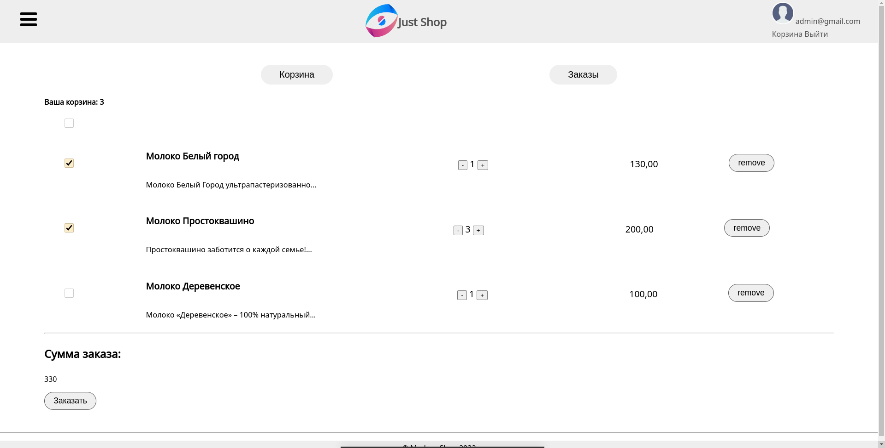
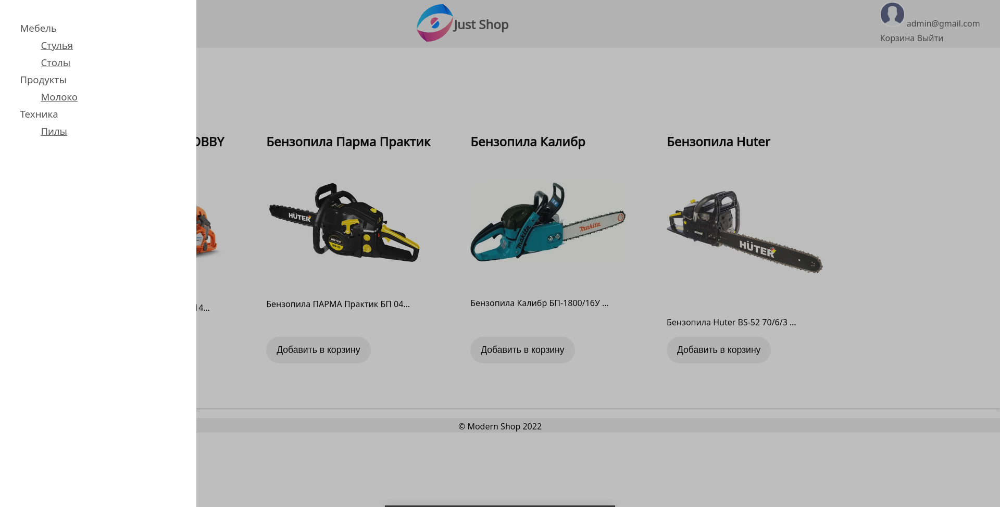

# Интерент-магазин на Django

## Установка:

1. Клонировать репозиторий и перейти в него в командной строке:
```sh
git clone https://github.com/sfkan6/django_shop.git
```
```sh
cd django_shop
```

### [Docker](https://docs.docker.com/get-docker/):

Создайте и запустите контейнер:
```sh
make docker
```

<details>
<summary>Запуск вручную</summary>

1. Создайте контейнер:
```sh
docker build -t shop .
```

2. Запустите контейнер:
```sh
docker run --rm -p 8000:8000 -it shop
```

</details>

### Запуск:

Выполните в консоли:
```sh
make fast-run
```

<details>
<summary>Запуск вручную</summary>

1. Войдите в виртуальное окружение:
```sh
python -m venv venv
```

```sh
source venv/Scripts/activate
```
или
```sh
source venv/bin/activate
```

2. Установите зависимости:
```sh
pip install -r requirements.txt
```

3. Перейдите в папку проекта:
```sh
cd django_shop
```

4. Выполните миграции:
```sh
python manage.py migrate
```

5. Загрузите данные в базу данных:
 ```sh
 python manage.py loaddata db.json
 ```

6. Запустите:
  ```sh
 python manage.py runserver 0.0.0.0:8000
 ```
 
</details>

Перейдите по ссылке: (http://0.0.0.0:8000)

### Админ:

Логин: admin@gmail.ru
Пароль: admin

<hr>



--------


--------

